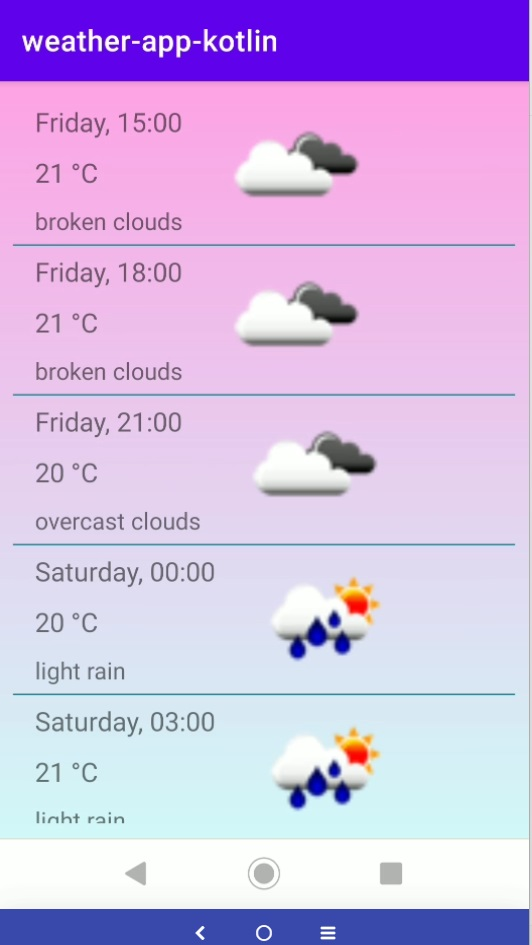

# Weather App For Android devices

This is a basic weather application that uses the users location
in providing weather data for that specific location.
User can also search for weather data all over the world.
Forecast is also available.
Screencast: https://www.youtube.com/watch?v=Fo5pIjLstY8

# Author

Seppo Hyvärinen

# Screenshots

The app asks for permission to use location:

If permission for location is granted, the app automatically fetches
the weather data for current location:

The weather data can be fetched from all over the world:

Forecast View:

# Technologies/Framework & Target devices

The language used is Kotlin and the app is targeted for Android devices. The API
used is https://openweathermap.org/api

